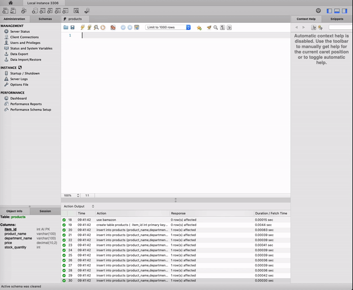
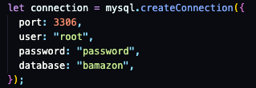
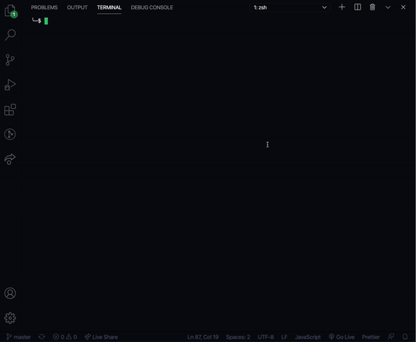

# Bamazon

This is a node application that simulates an online store

It was built using these dependencies

- [`inquirer`](https://www.npmjs.com/package/chalk)
- [`mysql2`](https://www.npmjs.com/package/chalk)

## Installation

1. Clone the repo to your computer
2. Run `npm -i` to install node dependencies
3. Open MySQL workbench
4. Paste code from db.sql and run to create database

5. Change MySQL credentials to match your own

## Using Bamazon

Once you have everything installed you can run the application through the terminal. Make sure you have an instance of your database running.

`node bamazon.js`

### Options

1. **inventory**

   - Lists every item in the store
   - Asks user to input the id of the item
   - Asks user to input the quantity

   - If purchase is successful
   - user will be notified of total purchase price
   - database will update stock quantity for that item
   - If item is not found
   - user will be notified item doesn't exist
   - If inventory is too low
     - user will be notified their purchase was unsuccessful

2. **exit**

   - exits the store

### Demo

